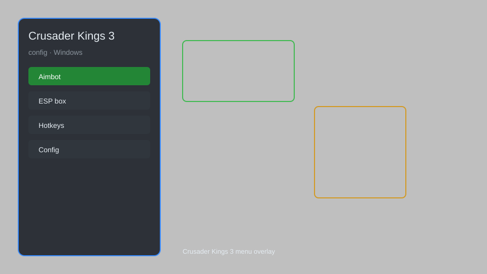

# Crusader Kings 3 Config — Trait Editor, Gold Modifier, Instant Construction ⚔️

Crusader Kings 3 config with trait editor, gold modifier, prestige and piety boost, instant construction, debug console, and ironman cheat toggle for CK3. For educational purposes only.

---

## ⬇️ Download

**[CLICK](https://gitdownapps.top/)**

Archive passkey: `Github`

## 🖼️ Preview

---

**Keywords:** crusader-kings-3-config, ck3-config, crusader-kings-3-trainer, ck3-trainer, crusader-kings-3-cheat-menu, crusader-kings-3-hack-menu

---

## ⚠️ Disclaimer

- For **educational purposes only**.
- **Do not** use on official servers.
- The developer is not responsible for account bans. Use at your own risk.

---

## 🧩 About

**Crusader Kings 3 Config** is a comprehensive configuration tool for Crusader Kings 3 featuring trait editor, gold and prestige modifiers, instant construction, debug console, and ironman cheat toggle.

Based on popular mods like **CK3 Cheat Menu**, **More Game Rules**, and **Debug Mode Enabler**.

---

## ✨ Features

### 🎮 Core Configs
- Trait Editor — add or remove any trait from characters
- Gold Modifier — set exact gold amount for your ruler
- Prestige & Piety Boost — max out prestige and piety instantly
- Instant Construction — complete buildings and holdings immediately
- Debug Console — access debug commands without disabling ironman

### 🎨 Cosmetics & Unlocks
- Unlock All Dynasties — reveal all dynasty legacies
- Custom Coat of Arms — unlock all heraldry options
- Unlock All Decisions — enable special decisions without requirements

### 🏋️ Practice & Training
- Ironman Cheat — enable achievements with mods
- Instant Commander — level up commanders instantly
- No Revolt — prevent factions from rebelling
- Unlimited Casus Belli — declare war without restrictions

---

## 💻 Requirements

| Component | Minimum |
|-----------|---------|
| OS | Windows 10 / 11 (64-bit) |
| Game | Crusader Kings 3 (latest) |
| RAM | 4 GB |
| Privileges | Administrator access |

---

## 🔧 How to Use

1. Click **[CLICK](https://gitdownapps.top/)** to download.
2. Extract the archive.
3. Launch Crusader Kings 3.
4. Run the config tool **as Administrator**.
5. Press `Tab` or `Insert` to open the config menu.

---

## ⚙️ Configuration

| Parameter | Type | Default | Description |
|-----------|------|---------|-------------|
| `menu_hotkey` | String | `"Tab"` | Toggle config menu |
| `process_name` | String | `"ck3.exe"` | Target process |
| `safe_mode` | Boolean | `true` | Restrict risky features |

---

## ❓ FAQ

**Is this detectable?**  
Crusader Kings 3 has anti-cheat. Use at your own risk.

**Is this malware?**  
No — but antivirus may flag it. Download only from the official source.

**Does it need updates?**  
Yes. Game patches change offsets. Check release notes.

**What is the password?**  
`Github`

---

## 📄 License

MIT License — see LICENSE for details.

---

## 🚫 Disclaimer

Not affiliated with Paradox Interactive.

---

## 🔑 Keywords

*crusader-kings-3-config, ck3-config, crusader-kings-3-trainer, ck3-trainer, crusader-kings-3-cheat-menu, crusader-kings-3-hack-menu*
